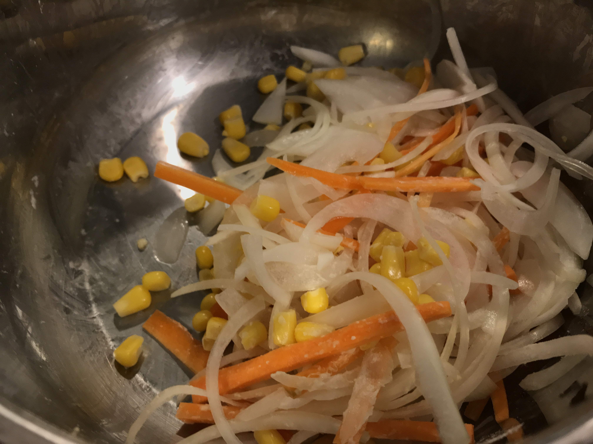
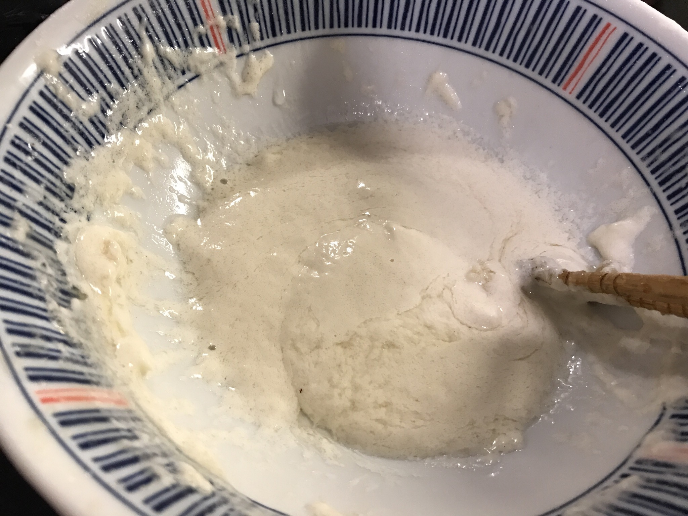
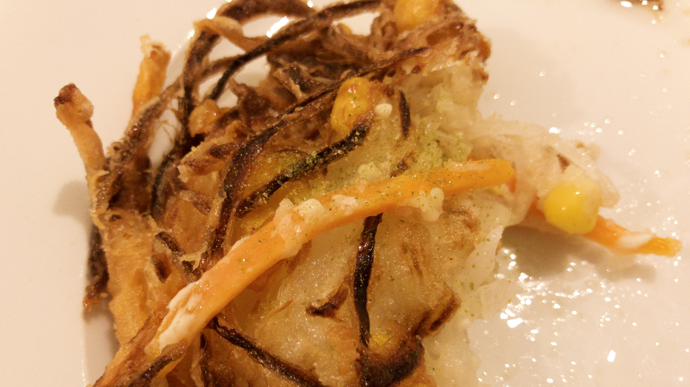

## Steps ##

1. Slice onions (julienne) and carrots (matchstick) [1](#fn-1)

2. Drain the corns, put them in a bowl, and add sliced onions and carrots. Add about a table spoonful of flour and mix well.

3. In another bowl, put flour, oil, and water.

4. In a soup plate, put one-serve worth of vegetables mix; scoop the flour mix in. Coat the vegetables with the flour mix 

5. Pour oil into a frying pan. 3-5mm. Heat it to 170 degrees Celsius 

6. Fry the mixture for 5-6 minutes

## Notes ##

Adapted the tips to make tempura crispy at [this site](https://mitok.info/?p=33647) <small>(in Japanese with good pictures)</small>. 

[^1]: at 1:33 to julienne onion, at 7:58 to matchstick carrots in [this video](https://www.facebook.com/1696961873920341/posts/2420285251587996?sfns=mo)
